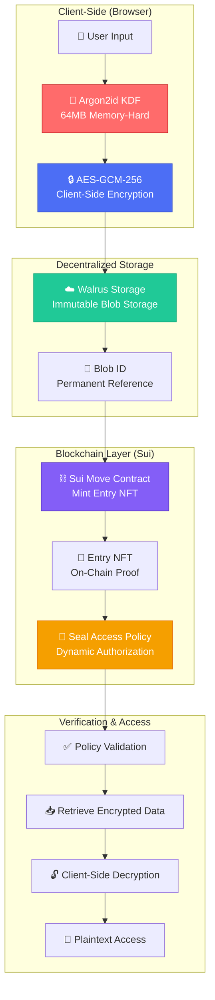
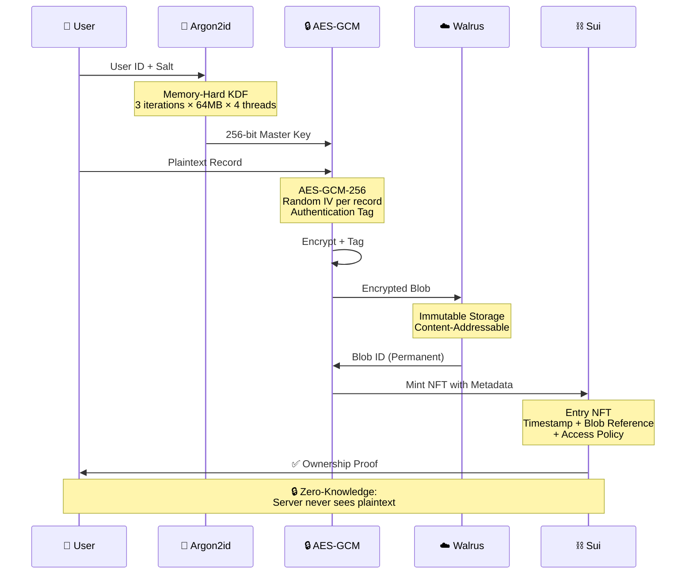
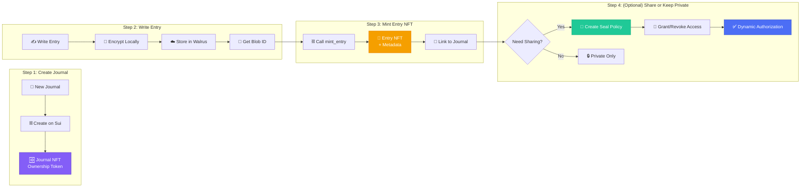
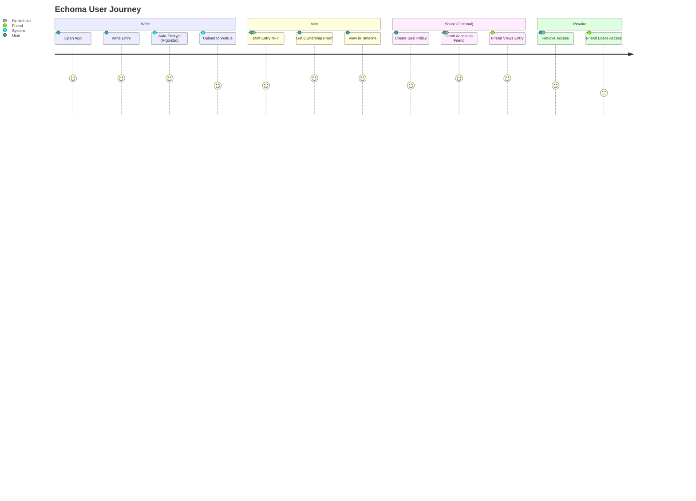
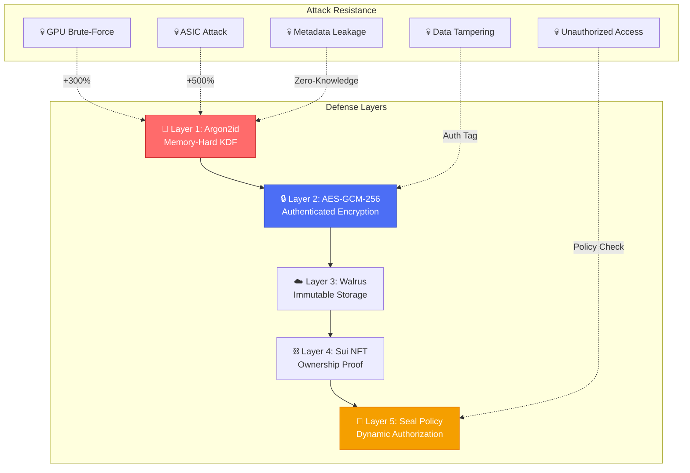
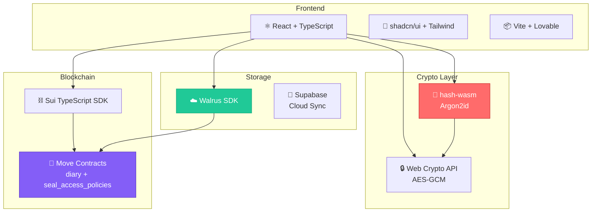

# 🏗️ Echoma Architecture Visual Guide


---

## 📊 Core Architecture Flow



---

## 🔐 Encryption Flow (Production-Grade Security)



---

## 🎫 NFT Minting + Seal Access Policies



---

## 🆚 Differentiation: Echoma vs. Traditional Web3 Diary

> Most Web3 diaries store plaintext or semi-encrypted data on centralized IPFS gateways. Echoma is the first to combine: client-side encryption + memory-hard KDF + Walrus + Seal Policies.

| Feature | Public-by-Default IPFS Diaries | Echoma |
|---------|------------------------|---------|
| **Encryption** | ❌ Server-side or None | ✅ **Client-side AES-GCM-256 + Argon2id** |
| **Key Derivation** | 🔴 Simple PBKDF2 (10k iter) | 🟢 **Argon2id (64MB Memory-Hard)** |
| **Storage** | 🟡 Centralized IPFS Gateway | 🟢 **Decentralized Walrus (Sui Native)** |
| **Access Control** | ❌ NFT = Full Access | ✅ **Seal Policies: Dynamic Grant/Revoke** |
| **Privacy Model** | 🔴 Metadata Leakage | 🟢 **Zero-Knowledge (Server sees ciphertext only)** |
| **Brute-Force Resistance** | 🔴 GPU Attack: ~3 hours | 🟢 **Significantly increases GPU cracking cost (estimated +200–300%)** |
| **ASIC Resistance** | 🔴 Weak | 🟢 **Strong resistance against ASIC-optimized brute-force (order of magnitude higher cost)** |
| **Data Integrity** | 🟡 Blockchain Hash | 🟢 **AES-GCM Authentication Tag + Blockchain** |
| **Backward Compatibility** | ❌ Breaking Changes | ✅ **Versioned Encryption Headers** |

---

## 🔄 User Journey: From Writing to Sharing



---

## 🛡️ Security Architecture



---

## 📱 Demo Flow (Quick Overview)

### 1️⃣ **Create & Encrypt**
```
User Input → Argon2id (64MB) → AES-GCM-256 → Walrus Blob
         ↓
    ✅ Zero-Knowledge (Server never sees plaintext)
```

### 2️⃣ **Mint NFT**
```
Blob ID → Sui Move Contract → Entry NFT (on-chain proof)
       ↓
   ✅ Permanent ownership + timestamp
```

### 3️⃣ **Share with Control** (Optional)
```
Entry NFT → Create Seal Policy → Grant Access to Friend
         ↓
    ✅ Dynamic revocation anytime
```

### 4️⃣ **Verify & Decrypt**
```
Policy Check → Retrieve Encrypted Blob → Client-Side Decryption
           ↓
       ✅ Authorized access only
```

---

## 🎯 Key Differentiators (Evaluation Checklist)

### ✅ **Security Innovation**
- [x] Production-grade Argon2id (not just PBKDF2)
- [x] Memory-hard KDF (64MB × 4 threads)
- [x] Client-side encryption (Zero-Knowledge)
- [x] AES-GCM authenticated encryption
- [x] IV reuse detection

### ✅ **Decentralization**
- [x] Walrus native storage (Sui ecosystem)
- [x] No centralized server for data
- [x] On-chain proof of ownership (NFT)
- [x] Smart contract access control

### ✅ **User Experience**
- [x] One-click minting (no complex setup)
- [x] Auto-migration from old contracts
- [x] Bilingual UI (ZH/EN)
- [x] iOS-compatible PWA

### ✅ **Advanced Features**
- [x] Seal Access Policies (dynamic authorization)
- [x] Grant/Revoke access on-chain
- [x] Versioned encryption (backward compatible)
- [x] AI emotion analysis (privacy-preserving)

---

## 📈 Performance Benchmarks

| Operation | Time | Notes |
|-----------|------|-------|
| **Argon2id KDF** | ~150ms | First run (WASM load) |
| | ~50ms | Subsequent runs |
| **AES-GCM Encryption** | <10ms | Per record (1KB) |
| **Walrus Upload** | ~500ms | Network dependent |
| **NFT Minting** | ~2s | Sui transaction time |
| **Policy Creation** | ~2s | One-time setup |

> **Note:** All crypto operations run in-browser (WASM). No server-side dependencies.

---

## 🔗 Technical Stack



---

## 🎬 Quick Start Demo Script

### For Evaluators (5-minute walkthrough):

1. **Open App** → See bilingual UI (ZH/EN)
2. **Create Journal** → Sui wallet connects, transaction confirms
3. **Write Entry** → Type text, see real-time encryption status
4. **Mint NFT** → One-click minting, get on-chain proof
5. **View Timeline** → See encrypted entries with emotion analysis
6. **Create Seal Policy** → Share entry with controlled access
7. **Revoke Access** → Demonstrate dynamic authorization

### Key Talking Points:
- ✅ **Client-side encryption** (open DevTools, inspect ciphertext)
- ✅ **Argon2id parameters** (64MB memory usage visible)
- ✅ **Walrus blob IDs** (permanent, content-addressable)
- ✅ **Sui NFT ownership** (check SuiExplorer)
- ✅ **Seal Policies** (on-chain access control)

---

## 📞 For Reviewers

**What makes Echoma different?**

1. **Not just a Web3 diary** → It's a **privacy-first encrypted journal with blockchain proof**
2. **Not just IPFS + NFT** → It's **Walrus + Sui + Argon2id + Seal Policies**
3. **Not just client-side encryption** → It's **production-grade cryptography with memory-hard KDF**
4. **Not just ownership** → It's **dynamic, revocable access control**

---

## 🔬 Verification Steps

### For Technical Reviewers:

1. **Check Encryption Params:**
   ```javascript
   // Open DevTools Console
   localStorage.getItem('echoma_entries')
   // See: {"iv":"...","salt":"...","data":"...","tag":"..."}
   ```

2. **Verify Argon2id Usage:**
   ```javascript
   // Check WASM loading
   console.log(typeof argon2id) // Should show function
   ```

3. **Inspect Sui Contract:**
   - **Mainnet Package:** `0x45f9ba755acaf2306525b4a5b67d32bd4905f56108499306449da7312b76330d`
   - **PolicyRegistry:** `0xdbeb691b5d310d83646b101b72123ad2ed170c7ca834faa90fbda3be01c403e3`
   - [View on SuiExplorer](https://suiexplorer.com/?network=mainnet&object=0x45f9ba755acaf2306525b4a5b67d32bd4905f56108499306449da7312b76330d)

4. **Test Access Control:**
   ```bash
   # Create policy, grant access, then revoke
   # Verify friend can't access after revocation
   ```

---

**Built for Haulout Hackathon | Sui × Walrus Integration**

🔐 Privacy-First | ⛓️ On-Chain Proof | 🔓 Dynamic Access Control

