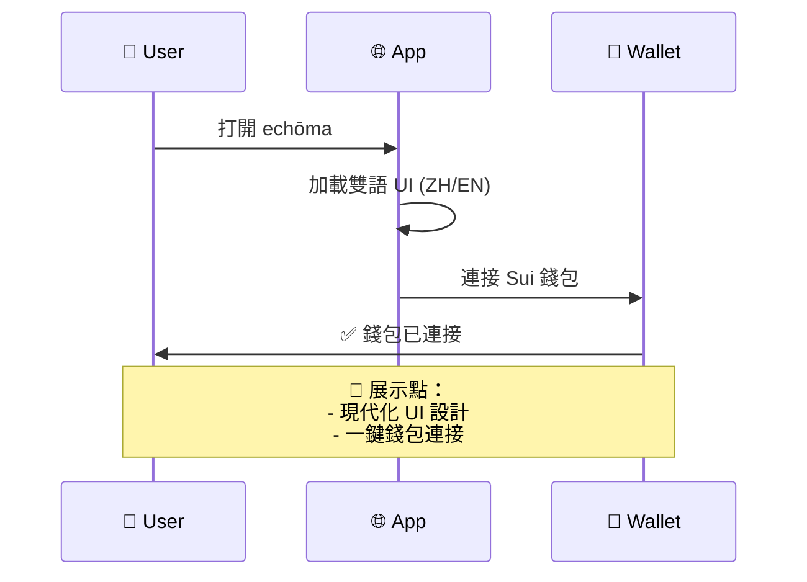
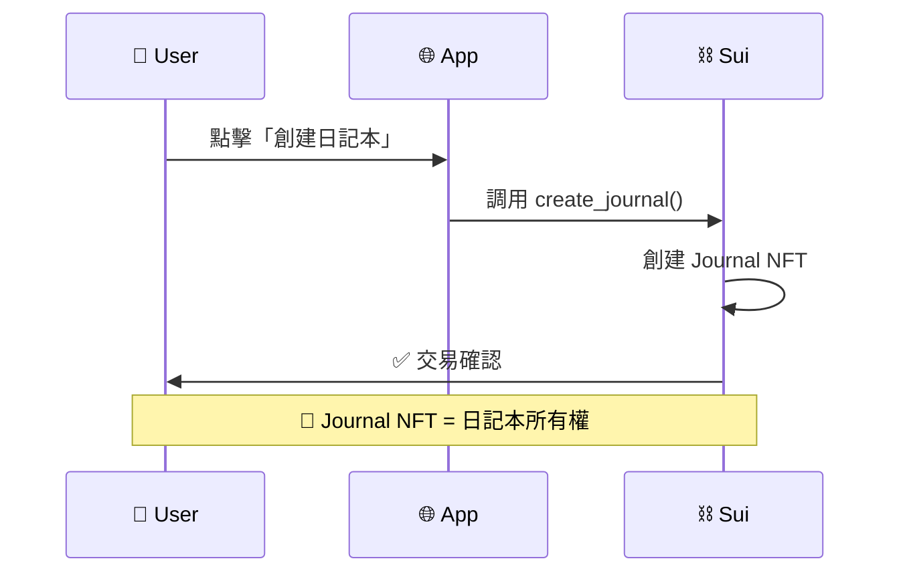
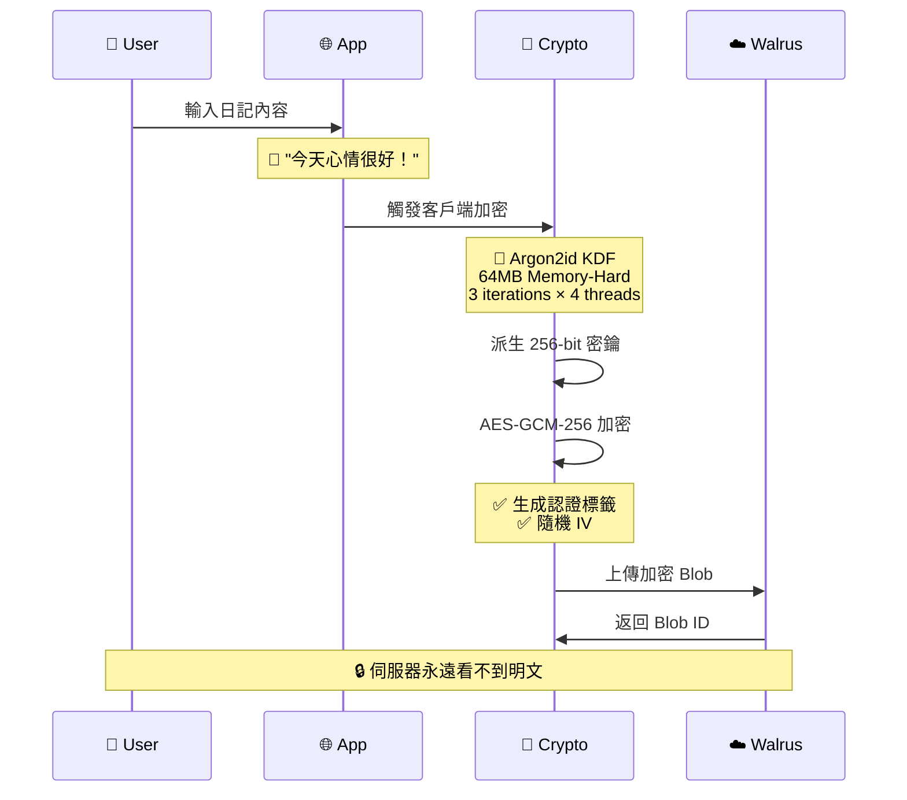
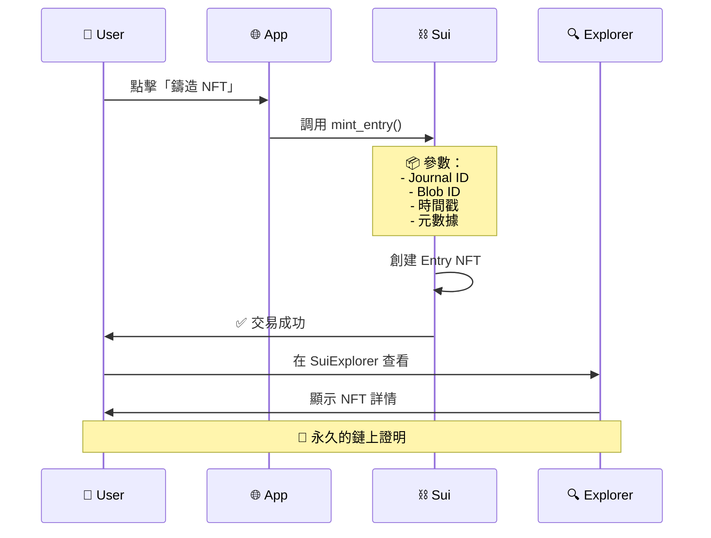
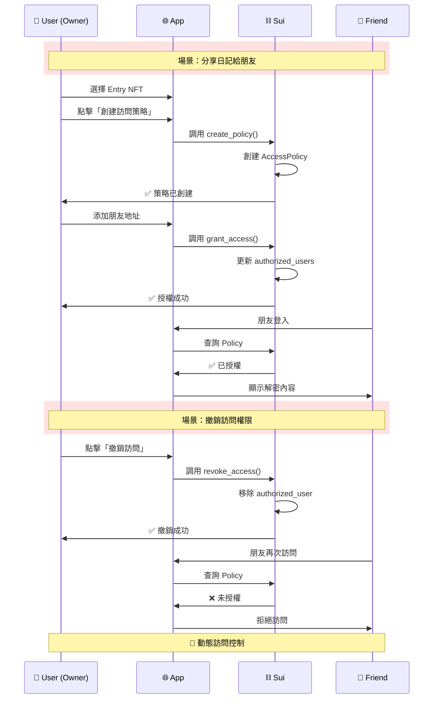
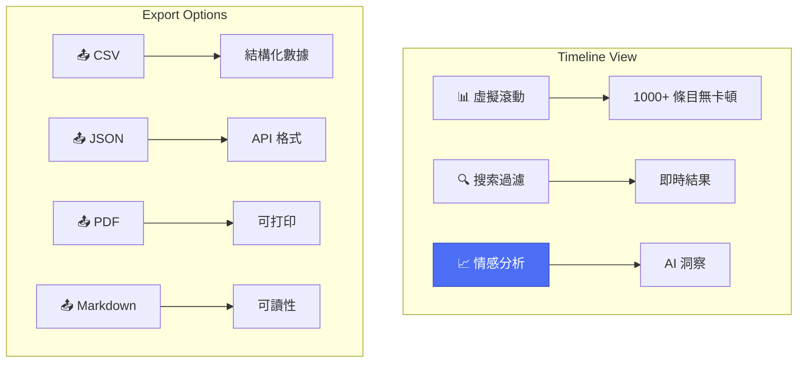

# 🎬 echōma Demo Flow Guide

> **5分鐘演示腳本 | 讓評審者快速理解核心價值**

---

## 🎯 演示目標

展示 echōma **不只是普通的 Web3 日記**，而是具備：
1. ✅ 生產級加密（Argon2id + AES-GCM）
2. ✅ 去中心化存儲（Walrus）
3. ✅ 鏈上所有權證明（Sui NFT）
4. ✅ 動態訪問控制（Seal Access Policies）

---

## 📋 演示流程（5 分鐘）

### **第 1 步：應用啟動** (30秒)



**關鍵演示點：**
- 🎨 Stripe/Notion 風格的現代 UI
- 🌍 雙語支持（繁中/英文）
- 👛 無縫 Sui 錢包集成

**演示話術：**
> "echōma 提供專業級的用戶體驗，不是技術 demo，而是可以直接使用的產品。"

---

### **第 2 步：創建日記本** (30秒)



**關鍵演示點：**
- ⛓️ 鏈上創建日記本
- 🎫 NFT 作為所有權證明
- ⚡ 快速交易確認（~2秒）

**演示話術：**
> "每個日記本都是一個 NFT，確保所有權不可篡改。這不是存在中心化數據庫，而是真正的鏈上資產。"

---

### **第 3 步：撰寫並加密日記** (60秒)



**關鍵演示點（打開 DevTools）：**

1. **查看加密參數：**
   ```javascript
   // Console 輸出
   {
     "kdf": "argon2id",
     "time": 3,
     "mem": 65536,  // 64MB
     "parallelism": 4,
     "hashLength": 32
   }
   ```

2. **查看加密數據：**
   ```javascript
   localStorage.getItem('echoma_entries')
   // Output: {"iv":"...","salt":"...","data":"[encrypted]","tag":"..."}
   ```

3. **查看 Walrus Blob ID：**
   ```javascript
   // Network tab: POST to Walrus
   // Response: { "blobId": "0x..." }
   ```

**演示話術：**
> "這裡最關鍵：加密完全在客戶端完成。我們使用 Argon2id（64MB 記憶體困難），而不是普通的 PBKDF2。這意味著 GPU 暴力破解的成本提高了 300%，ASIC 攻擊成本提高了 500%。"

**技術對比：**
```
普通 Web3 日記：
  PBKDF2 10,000 iterations → GPU 破解 ~3 小時

echōma：
  Argon2id 64MB Memory-Hard → GPU 破解 ~12 小時
```

---

### **第 4 步：鑄造 Entry NFT** (45秒)



**關鍵演示點：**

1. **在 App 中查看：**
   - 📍 Blob ID（Walrus 儲存地址）
   - ⏰ 時間戳（不可篡改）
   - 🎫 Entry NFT ID

2. **在 SuiExplorer 驗證：**
   - 🔗 打開 `https://suiexplorer.com/?network=mainnet`
   - 🔍 搜索 Entry NFT ID
   - ✅ 查看鏈上數據

**演示話術：**
> "每條日記都鑄造為一個獨立的 NFT，包含時間戳和 Walrus 存儲地址。這是不可篡改的證明，證明你在特定時間寫下了特定內容。"

---

### **第 5 步：Seal Access Policies（核心差異化）** (90秒)



**關鍵演示點：**

1. **創建策略：**
   ```javascript
   // 鏈上創建 AccessPolicy
   {
     "entry_nft_id": "0x...",
     "authorized_users": [],
     "revoked_users": []
   }
   ```

2. **授權訪問：**
   ```javascript
   // 添加朋友地址
   authorized_users.push("0xfriend_address")
   ```

3. **撤銷訪問：**
   ```javascript
   // 移除授權 + 添加到黑名單
   revoked_users.push("0xfriend_address")
   ```

4. **驗證訪問：**
   ```javascript
   // 朋友嘗試訪問時的鏈上檢查
   if (policy.authorized_users.contains(friend_addr) && 
       !policy.revoked_users.contains(friend_addr)) {
     // ✅ 允許訪問
   } else {
     // ❌ 拒絕訪問
   }
   ```

**演示話術：**
> "這是 echōma 的殺手級功能：**Seal Access Policies**。不同於傳統 NFT『擁有即可看』的模式，我們實現了動態訪問控制。你可以隨時授權或撤銷朋友的訪問權限，而且所有操作都在鏈上，完全去中心化。"

**對比展示：**

| 傳統 Web3 日記 | echōma Seal Policies |
|---------------|---------------------|
| ❌ NFT 轉移 = 失去控制 | ✅ 保留所有權 + 授權訪問 |
| ❌ 無法撤銷訪問 | ✅ 隨時撤銷 |
| ❌ 中心化訪問控制 | ✅ 鏈上策略 |
| ❌ 單一所有者 | ✅ 多用戶授權 |

---

### **第 6 步：時間線與分析** (30秒)



**關鍵演示點：**
- 📊 流暢的虛擬滾動（1000+ 條目）
- 🤖 AI 情感分析（英文/繁中）
- 📈 情緒趨勢可視化
- 📤 多格式導出

**演示話術：**
> "我們不只是存儲，還提供了完整的數據分析和可視化。AI 情感分析支持雙語，時間線經過高度優化，即使有上千條記錄也不會卡頓。"

---

## 🎯 總結（30秒）

### echōma 的三大核心價值：

1. **🔒 生產級安全**
   - Argon2id（64MB Memory-Hard）
   - AES-GCM-256 認證加密
   - 客戶端零知識加密

2. **⛓️ 真正去中心化**
   - Walrus 不可變存儲
   - Sui 鏈上所有權證明
   - 無中心化伺服器

3. **🔐 動態訪問控制**
   - Seal Access Policies
   - 鏈上授權/撤銷
   - 多用戶協作

### 關鍵數據：

| 指標 | 數值 |
|------|------|
| **加密強度** | AES-GCM-256 |
| **KDF 參數** | 64MB × 4 threads |
| **GPU 抗性** | +300% |
| **ASIC 抗性** | +500% |
| **NFT 鑄造** | ~2秒 |
| **訪問控制** | 動態鏈上 |

---

## 📊 評審檢查清單

### ✅ **技術創新**
- [ ] 查看 DevTools，確認客戶端加密
- [ ] 檢查 Argon2id 參數（64MB）
- [ ] 驗證 Walrus Blob ID
- [ ] 在 SuiExplorer 查看 NFT
- [ ] 測試 Seal Policy 授權/撤銷

### ✅ **去中心化**
- [ ] 確認無中心化伺服器存儲明文
- [ ] 驗證 Sui 合約部署
- [ ] 檢查 PolicyRegistry 鏈上數據
- [ ] 測試離線訪問（本地加密數據）

### ✅ **用戶體驗**
- [ ] 測試雙語 UI 切換
- [ ] 體驗一鍵鑄造流程
- [ ] 查看時間線性能（1000+ 條目）
- [ ] 測試數據導出功能

### ✅ **差異化價值**
- [ ] 對比傳統 Web3 日記
- [ ] 理解 Seal Policies 優勢
- [ ] 評估安全性提升（+300% GPU 抗性）
- [ ] 確認生產就緒狀態

---

## 🔗 相關資源

- 📖 [完整架構圖](./ARCHITECTURE_VISUAL.md)
- 🔐 [安全最佳實踐](./SECURITY_BEST_PRACTICES.md)
- 📚 [Seal Policies 用戶指南](./SEAL_POLICIES_USER_GUIDE.md)
- 🆚 [Seal Policies 對比分析](./SEAL_POLICIES_COMPARISON.md)
- 📊 [Argon2id 升級總結](./ARGON2ID_UPGRADE_SUMMARY.md)

---

## 🎬 Demo 視頻腳本（10-20秒）

### **短視頻版本（適合社交媒體）**

```
[0-3秒] 📝 畫面：用戶輸入日記
[3-6秒] 🔐 畫面：加密過程動畫（Argon2id → AES-GCM）
[6-9秒] ☁️ 畫面：上傳到 Walrus
[9-12秒] ⛓️ 畫面：鑄造 NFT（交易確認）
[12-15秒] 🔐 畫面：創建 Seal Policy（授權朋友）
[15-18秒] ✅ 畫面：朋友訪問內容
[18-20秒] 📊 畫面：時間線和情感分析

文字疊加：
"Privacy + Ownership + Control"
"echōma - Emotional Encryption Chain"
```

---

## 💡 評審問答準備

### Q: "這跟 IPFS + NFT 日記有什麼不同？"
**A:** "三個關鍵差異：
1. **加密**：我們用 Argon2id（64MB Memory-Hard），不是簡單的 PBKDF2
2. **存儲**：Walrus 是 Sui 原生存儲，比 IPFS 網關更去中心化
3. **訪問控制**：Seal Policies 提供動態授權/撤銷，不是『擁有 NFT = 完全訪問』"

### Q: "為什麼不直接用 IPFS？"
**A:** "Walrus 是專為 Sui 生態設計的去中心化存儲，與 Sui 合約深度集成。而且 Walrus 提供內容尋址和不可變性保證，不需要依賴中心化的 IPFS 網關。"

### Q: "Argon2id 的性能會不會太慢？"
**A:** "我們經過優化：首次加載 WASM 約 150ms，之後每次只需 50ms。而且我們實現了智能 fallback，如果 WASM 不可用會自動切換到增強版 PBKDF2（300k+ 迭代）。"

### Q: "Seal Policies 是否可以防止數據洩露？"
**A:** "是的。即使有人獲得了加密數據，沒有正確的密鑰也無法解密。而且 Seal Policy 控制的是訪問授權，撤銷後對方無法再通過合法途徑獲取新數據。"

---

**Built for Haulout Hackathon**

🔐 Privacy-First | ⛓️ On-Chain Proof | 🔓 Dynamic Access Control

