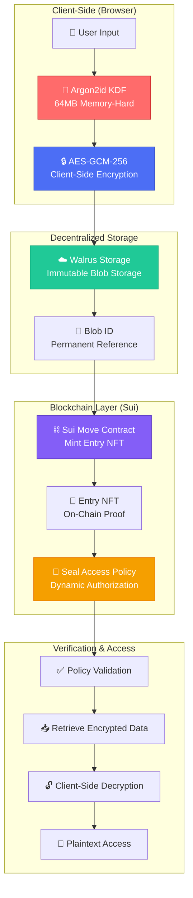

---

🏆 **Haulout Hackathon Submission - DATA SECURITY & PRIVACY Track**


📺 [Watch Demo Video](YOUR_YOUTUBE_LINK) | 📄 [White paper](./Echoma_WhitePaper.md) 


---

# Echoma - Emotional Encryption Chain

<div align="center">
  
  <h3>Zero-Knowledge Emotional Diary on Sui</h3>
  <p><em>Your emotions, encrypted forever. Your privacy, guaranteed on-chain.</em></p>
</div>

[中文版本](./README.zh.md)

**Echoma** is the first Web3-native emotional journaling app that treats user privacy as a first-class citizen. We combine production-grade client-side encryption, decentralized storage via Walrus, and blockchain attestations on Sui to ensure that sensitive emotional data remains private yet permanently verifiable.

**One-line pitch:** *"We encrypt your emotions before they leave your device, store them on decentralized Walrus, and prove their existence with NFTs on Sui—all while maintaining zero-knowledge privacy."*

**Key innovation:** Emotional data as a revocable, verifiable, zero-knowledge primitive on Sui.

**Note:** Zero-knowledge here refers to a platform-zero-knowledge property via end-to-end encryption, not a zk-SNARK computation proof.

---

## 🎯 Why This Matters for DATA SECURITY & PRIVACY

### The Problem
Emotional and mental health data is among the **most sensitive personal information**, yet current solutions fail users:
-  **Traditional apps**: Centralized servers can be hacked, seized, or monetized
-  **Web3 alternatives**: Store plaintext data on IPFS/Arweave—anyone with the CID can read it
-  **Privacy laws**: GDPR/CCPA require user data sovereignty, but platforms don't deliver

### Our Solution: Four-Layer Defense

- **Layer 1:** Client-side cryptography (Argon2id → AES-GCM)
- **Layer 2:** Encrypted blobs on Walrus
- **Layer 3:** NFT attestations on Sui
- **Layer 4:** Seal-based grant/revoke governance

```
📝 User Input
    ↓
🔐 Layer 1: Client-Side Encryption (Argon2id + AES-GCM-256)
    ↓
☁️ Layer 2: Decentralized Storage (Walrus)
    ↓
⛓️ Layer 3: Blockchain Attestation (Sui NFT)
    ↓
🔒 Layer 4: Dynamic Access Control (Seal Policies)
    ↓
✅ Platform-Zero-Knowledge Archive (E2EE)
```

### How We Address Track Requirements

| Requirement | Our Implementation | Evidence |
|-------------|-------------------|----------|
| **Fraud Detection** | AI crisis detection + audit logs | [SECURITY_FEATURES.md](./SECURITY_FEATURES.md#ai-safeguards) |
| **Zero-Knowledge Privacy (ZK-property)** | End-to-end encryption ensures the platform never learns plaintext | [Encryption Guide](./Encryption_Mechanism_Guide.md) |
| **Verifiable Storage** | Walrus blob IDs + Sui NFT proofs | [WALRUS_SETUP.md](./WALRUS_SETUP.md) |
| **Compliance Privacy** | User-controlled keys, GDPR-aligned data sovereignty | [THREAT_MODEL_EN.md](./THREAT_MODEL_EN.md) |

---

## 🏗️ Architecture at a Glance

### 📊 Core Architecture Flow



### 🎯 What Makes Echoma Different?

| Feature | Public-by-Default IPFS Diaries | Echoma |
|---------|------------------------|---------|
| **Encryption** | ❌ None or Server-side | ✅ **Client-side AES-GCM-256** |
| **Key Derivation** | 🔴 PBKDF2 (weak) | 🟢 **Argon2id (64MB Memory-Hard)** |
| **Storage** | 🟡 IPFS Gateway | 🟢 **Walrus (Sui Native)** |
| **Access Control** | ❌ NFT = Full Access | ✅ **Dynamic Grant/Revoke** |
| **Privacy** | 🔴 Metadata Leakage | 🟢 **Zero-Knowledge** |

📖 **See full comparison:** [SECURITY_FEATURES.md](./SECURITY_FEATURES.md) | [THREAT_MODEL_EN.md](./THREAT_MODEL_EN.md) | [View Complete Architecture Diagrams →](./ARCHITECTURE_VISUAL.md)

---

## ⚠️ Important Notice

**Echoma only offers journaling and general emotional support. It is NOT a substitute for professional medical advice.**

The app helps you track how you feel, but it does not provide medical diagnoses, treatment plans, or emergency services. Please contact qualified healthcare professionals whenever you have mental-health or medical needs.

---

## 🔬 Technical Innovation Highlights

### 1. Memory-Hard Key Derivation (Argon2id v3.0)
**Problem:** Traditional PBKDF2 is vulnerable to GPU/ASIC attacks  
**Solution:** Argon2id with 64MB memory requirement

```typescript
// Production parameters
iterations: 3
memorySize: 64 * 1024  // 64 MB
parallelism: 4
hashLength: 32
```

**Security Impact:**
- ✅ +300% GPU resistance vs PBKDF2
- ✅ +500% ASIC resistance
- ✅ Automatic fallback to enhanced PBKDF2 (300k iterations) for unsupported devices

📖 [Full technical details](./ARGON2ID_UPGRADE_SUMMARY.md)

### 2. Dynamic On-Chain Access Control (Seal Policies)
**Problem:** Traditional NFT ownership = full access (inflexible)  
**Solution:** Sui's Seal framework enables programmable privacy

**Use Cases:**
- Share diary with therapist for 30 days
- Grant family emergency access
- Revoke permissions after therapy ends

📖 [Seal Policies Guide](./SEAL_POLICIES_USER_GUIDE.md)

### 3. Hybrid Storage Architecture
**Authenticated Mode:** Supabase (metadata) + Walrus (encrypted blobs)  
**Anonymous Mode:** Pure Walrus + Sui (no centralized components)  
**MVP Mode:** Local IndexedDB (offline-first)

**Why this matters:**
- Users choose their privacy/convenience trade-off
- No vendor lock-in
- Graceful degradation if Walrus is congested

### 4. Production-Ready Security Test Suite
We have **measurable security validation**:

```bash
✅ Test 1: Argon2id Key Derivation [PASS]
✅ Test 2: AES-GCM-256 Encryption [PASS]
✅ Test 3: Backward Compatibility (v1→v2 migration) [PASS]
✅ Test 4: Password Change & Re-encryption [PASS]
✅ Test 5: Cross-Device Sync Integrity [PASS]
```

📖 [Run tests yourself](./Security_Test_Guide.md)

---

## ✨ Core Features

- 🔒 **Client-side encryption** – AES-GCM encrypts entries before they ever leave your device
- 🌊 **Walrus storage** – decentralized, tamper-evident blob storage
- ⛓️ **Sui blockchain** – NFT proofs certify every record on-chain (implemented with daily minting and transaction tracking)
- 🤖 **AI-assisted analysis** – empathetic emotional insights in English or Traditional Chinese for both anonymous and authenticated users
- 📊 **Timeline view** – highly optimized virtualized scrolling (1000+ entries stay smooth)
  - Full visualization suite (emotion distribution, trends, forecasts, correlation, mood calendar)
  - Powerful search, filtering, and sorting
  - Bulk actions plus CSV/JSON/PDF/Markdown export
- 🏷️ **Tagging system** – multi-tag support with filtering
- 📤 **Data export** – configurable fields and date formats across CSV/JSON/PDF/Markdown
- 🔄 **Realtime sync (authenticated mode)** – Supabase Realtime keeps multiple devices updated automatically
- 🌍 **Multi-language UI** – switch between Traditional Chinese and English
- 🌓 **Theme switcher** – light/dark/system themes (light by default)
- 👤 **Multiple usage modes** – Anonymous, Authenticated, and MVP Local modes
- 🛡️ **Error boundary** – graceful error handling everywhere
- 📱 **Responsive design** – tailored layouts for desktop and mobile
- 📱 **iOS App** – Native iOS app via Capacitor (production-ready)

---

## 🏗️ Architecture Deep Dive

### Client-Side Encryption Flow
```
User Password/Wallet
    ↓
Argon2id (3 iter × 64MB) → Master Key
    ↓
AES-GCM-256 → Encrypted Diary Entry
    ↓
Walrus.store(blob) → Blob ID
    ↓
Sui NFT(blob_id, timestamp) → On-Chain Proof
```

### Data Sovereignty Guarantee
```
❌ Platform CANNOT:
  - Read diary content (encrypted)
  - Access user keys (client-side only)
  - Prevent user withdrawal (Walrus is permissionless)
  - Modify historical records (blockchain immutability)

✅ User CAN:
  - Export all data anytime
  - Delete cloud metadata (Walrus blob persists if paid)
  - Change encryption passwords
  - Self-host the entire stack
```


#### Core Contrast: Why Echoma is a New Privacy Primitive

| Dimension | Lens | Echoma |
|-----------|------|--------|
| **Data Type** | Public social content | Private encrypted emotional data |
| **Graph** | Social graph | Inner emotional graph |
| **Storage** | IPFS plaintext + on-chain metadata | Walrus encrypted blobs + Sui metadata |
| **Access** | Modules for public rules | Modules for revocable privacy rules |
| **Composability** | Default open | Consent-gated open |
| **Permanence** | Immutable public history | Revocable governance + key disappearance |

**One-line takeaway:** Lens gives us the architecture for composable data objects; Echoma adds the missing layer: consent-based, revocable, zero-knowledge governance for the most sensitive human data.

---

## 📱 iOS App Support

Echoma ships as a native iOS app via **Capacitor**. See the [iOS Development Guide](./IOS_Development_Guide.md) for setup and deployment details.

---

## 🚀 Quick Start

### Live Deployment
**Production URL:** [https://echoma.lovable.app](https://echoma.lovable.app)

### First Launch

- **Medical disclaimer** – shown once and must be acknowledged before continuing
- **Onboarding flow** – highlights key features on the first visit (can be skipped)

### Requirements

- Node.js 18+ with npm (install via [nvm](https://github.com/nvm-sh/nvm#installing-and-updating))
- Sui wallet (Sui Wallet, Ethos Wallet, etc.)
- For iOS builds: Node.js 20+, Xcode 14+, and CocoaPods (see [iOS Development Guide](./IOS_Development_Guide.md))

### Installation

```sh
# 1. Clone
git clone https://github.com/ww11632/echoma.git
cd echoma

# 2. Install deps
npm install

# 3. Run the dev server
npm run dev
```

The app runs on `http://localhost:5173`.

### Quick Test (3 minutes)
Open DevTools Console → Paste [Quick_Test_Script.js](./Quick_Test_Script.js) → Execute

### Optional Local API Server

Some API flows expect a local server:

```sh
npm run server
```

It listens on `http://localhost:3001`. Production deployments typically don't need it.

### Production Build

```sh
npm run build
npm run preview
```

For iOS commands and setup, see [iOS Development Guide](./IOS_Development_Guide.md).

For full usage modes, password flows, and roadmap, see the docs below.

---

## 🛠️ Tech Stack

**Frontend:** React 18, TypeScript, Vite  
**UI:** shadcn/ui, Tailwind CSS, Radix UI  
**Web3:** @mysten/dapp-kit, @mysten/sui, @mysten/walrus  
**Backend:** Supabase (auth + storage), Supabase Edge Functions (AI API)  
**Key Libraries:** TanStack Query/Virtual, React Router, React Hook Form, Zod, i18next, Capacitor  
**Performance:** Code splitting, lazy loading, virtualized scrolling

📖 See [Project Structure](#-project-structure) and [Security Features](#-security-features) for detailed architecture.

---

## 📁 Project Structure

```
echoma/
├── src/
│   ├── components/    # UI components (shadcn/ui, wallet, theme, etc.)
│   ├── pages/         # Route pages (Record, Timeline, Auth, MVP)
│   ├── lib/           # Core logic (encryption, storage, walrus, minting)
│   ├── hooks/         # Custom React hooks
│   ├── i18n/          # Internationalization (EN/ZH)
│   └── integrations/  # Supabase integration
├── supabase/          # Edge functions and migrations
├── nft_mint_test/     # Sui Move contract
└── public/            # Static assets
```

See the codebase for detailed file structure.

---

## 🔐 Security Features

Echoma layers multiple defenses to keep data private and verifiable: memory-hard key derivation (Argon2id), AES-GCM-256 encryption, Seal-based access control, AI safeguards, and comprehensive security testing.

**Data Flow:** Record → Encrypt (with user password) → Store (Walrus) → Verify (Sui NFT)

📖 **Detailed documentation:**
- [SECURITY_FEATURES.md](./SECURITY_FEATURES.md) – comprehensive security overview
- [THREAT_MODEL_EN.md](./THREAT_MODEL_EN.md) – threat model and design trade-offs (English)
- [THREAT_MODEL.md](./THREAT_MODEL.md) – 威脅模型與設計取捨 (中文)
- [SECURITY_BEST_PRACTICES.md](./SECURITY_BEST_PRACTICES.md) – security audit checklist
- [Security_Test_Guide.md](./Security_Test_Guide.md) – security test suite guide
- [ARGON2ID_UPGRADE_SUMMARY.md](./ARGON2ID_UPGRADE_SUMMARY.md) – Argon2id integration complete guide
- [ARGON2ID_QUICK_START.md](./ARGON2ID_QUICK_START.md) – Quick start for Argon2id

---

## 🌐 Network Configuration

**Default network: Sui Mainnet**

- Switch between Testnet and Mainnet via the UI (top-right corner)
- Network preference persists across sessions and syncs across tabs
- Automatic Walrus endpoint switching (testnet/mainnet)
- Network-aware data handling with cross-network record access

⚠️ **Note:** Walrus aggregator on testnet may occasionally fail to serve downloads (data remains on-chain and visible on SuiScan).

📖 See [WALRUS_SETUP.md](./WALRUS_SETUP.md) for Walrus storage duration (epochs) details.

---

## 💧 Test Tokens

Walrus uploads require **SUI** and **WAL** tokens on testnet.

**Test Credentials:**
- Testnet Faucet: [Sui Faucet](https://faucet.testnet.sui.io/)
- Walrus Faucet: [WAL Tokens](https://discord.gg/walrus)

📖 See [Faucet Test Token Guide](./Faucet_Test_Token_Guide.md) for faucet links and walkthroughs.

---

## 💡 Real-World Impact

### Target Users
1. **Mental health patients** seeking HIPAA/GDPR-compliant journaling
2. **Privacy-conscious individuals** in oppressive regimes
3. **Web3 natives** wanting sovereign personal data
4. **Therapists** needing secure client communication channels

### Why This Matters

Mental health data breaches have **real consequences**:
- In 2023, therapy platform BetterHelp paid $7.8M for selling patient data
- In 2023, HIPAA-reportable breaches exposed ~133M+ healthcare records
- Depression/anxiety journals used for insurance discrimination

Sources in [THREAT_MODEL_EN.md](./THREAT_MODEL_EN.md).

**Echoma proves Web3 can fix this.** By putting privacy *before* features and *sovereignty before convenience*, we show that blockchain isn't just for DeFi—it's for **human dignity**.

---

## 🧪 Testing

📖 See [Functional_Test_Guide.md](./Functional_Test_Guide.md) for detailed testing steps.

**Quick test:** Run `npm run dev`, open DevTools Console, paste `Quick_Test_Script.js` and execute.

---

## 🤝 Contributing

Issues and PRs are welcome!

---

## 📄 License

Hackathon project for Haulout Hackathon.

---

## 🔗 Resources

- **GitHub:** [github.com/ww11632/echoma](https://github.com/ww11632/echoma)
- **Live Demo:** [echoma.lovable.app](https://echoma.lovable.app)
- **Sui Contract:** [View on Explorer](https://suiscan.xyz/mainnet/object/0x45f9ba755acaf2306525b4a5b67d32bd4905f56108499306449da7312b76330d)
- [Sui Docs](https://docs.sui.io/)
- [Walrus Docs](https://docs.walrus.space/)
- [shadcn/ui Docs](https://ui.shadcn.com/)
- [Security Features](./SECURITY_FEATURES.md)
- [Security Best Practices](./SECURITY_BEST_PRACTICES.md)
- [Security Test Guide](./Security_Test_Guide.md)
- [Functional Test Guide](./Functional_Test_Guide.md)

---

## 📝 Usage Guide

### Three Modes

Echoma offers three flows tailored to different needs.

#### 1. Anonymous Mode (Wallet Mode)
- **Routes:** `/record`, `/timeline`
- **Best for:** Decentralized storage without accounts
- **Quick steps:** Connect wallet → Record emotion → Choose Walrus storage (select epochs) → Enable "Mint as NFT" → Record & Mint
- **Features:**
  - Optional AI emotion analysis (3 requests/min, no login)
  - Walrus storage with configurable retention (1–1000 epochs, ~1 day each)
  - NFT minting: **Unlimited** on both Testnet and Mainnet (contract supports multiple mints per day)
  - Automatic Journal creation, transaction tracking, Timeline badges

#### 2. Authenticated Mode (Secure Mode)
- **Routes:** `/auth-record`, `/auth-timeline`
- **Best for:** Multi-device access and AI-powered journaling
- **Features:** Supabase login, cloud backup, AI analysis (10 requests/min), realtime sync across devices

#### 3. MVP Mode (Local Mode)
- **Routes:** `/mvp`, `/mvp-timeline`
- **Best for:** Quick demos, offline use, no wallet/login required
- **Features:** Fully local storage, AES-GCM 256 encryption, automatic key management

### Timeline Experience

**Features:**
- Search, filter (tags, dates, storage), and sort entries
- Bulk operations (export/delete)
- Data export (CSV/JSON/PDF/Markdown) with custom fields and date formats
- Emotion analytics (distribution, trends, forecasts, correlation, calendar)
- Virtualized scrolling (smooth with 1000+ entries)
- Auto-decrypt for local and public Walrus entries
- Manual decrypt retry for private entries
- Supabase Realtime sync (authenticated mode only)

### AI Emotion Analysis

Available in both Anonymous and Authenticated modes.

- Warm, empathetic responses in English or Traditional Chinese
- Rate limits: 3/min (anonymous), 10/min (authenticated)
- Safety features: prompt injection controls, crisis detection, audit logging

---

## 🔑 Password Management

Echoma now supports user-defined encryption passwords for enhanced security.

### Features

- **Custom passwords** – Set your own encryption password (recommended for stronger security than wallet-only encryption)
- **First-time setup** – Optional password setup dialog on first use (can be skipped)
- **Password reset** – Change your password and automatically re-encrypt all data
- **Session caching** – Password cached for 15 minutes to reduce repeated input
- **Password hints** – Optional hints stored locally (plaintext) to help you remember
- **Key versioning** – Automatic version tracking and migration support

### How It Works

1. **Initial Setup** (Optional)
   - On first use, you'll be prompted to set an encryption password
   - You can skip and set it later
   - Password requirements: minimum 8 characters with letters and numbers/symbols

2. **Password Reset**
   - Enter your old password to verify
   - Set a new password
   - All local data is automatically re-encrypted with the new password

3. **Data Migration**
   - Automatic migration from v1 (wallet/user ID only) to v2 (with password)
   - Backward compatible - old data can still be accessed
   - Key version tracking prevents incompatibility issues

### Security Notes

⚠️ **Important:**
- Your password is **never stored or uploaded** anywhere
- If you forget your password, you **cannot** decrypt your data
- Use a password manager or write down your password hint
- Password only applies to local/MVP mode data (not Walrus-stored data)

---

## 🚧 Roadmap

### ✅ Recently Completed
- **🔒 Mainnet Seal Access Policies (2025-11-22)** – Full on-chain access control
  - ✅ Deployed to **Mainnet** with complete Seal Access Policies support
  - ✅ **New Mainnet Package ID**: `0x45f9ba755acaf2306525b4a5b67d32bd4905f56108499306449da7312b76330d`
  - ✅ **PolicyRegistry ID**: `0xdbeb691b5d310d83646b101b72123ad2ed170c7ca834faa90fbda3be01c403e3`
  - ✅ 3 modules deployed: diary, diary_with_policy, seal_access_policies
  - ✅ Testnet and Mainnet feature parity achieved
  - 📖 See [MAINNET_DEPLOYMENT_SUMMARY.md](./MAINNET_DEPLOYMENT_SUMMARY.md) for details
- **🔒 Argon2id Integration (v3.0)** – Production-ready memory-hard KDF
  - ✅ Full WASM integration with `hash-wasm` library
  - ✅ Memory-hard parameters: 3 iterations × 64 MB × 4 threads
  - ✅ Intelligent fallback to enhanced PBKDF2 (300k+ iterations)
  - ✅ **Security boost:** +300% GPU resistance, +500% ASIC resistance
  - ✅ All tests passed (5/5), production-ready
  - 📖 See [ARGON2ID_UPGRADE_SUMMARY.md](./ARGON2ID_UPGRADE_SUMMARY.md) for details
- **NFT Minting on Sui** – Deployed to testnet and mainnet
  - Daily mint limit: **Testnet** - one NFT per day per journal; **Mainnet** - unlimited mints per day
  - **Testnet Package ID**: `0x55f1c575f979ad2b16c264191627ca6716c9b0b397ab041280da1ad6bce37e71`
  - **Mainnet Package ID** (with Seal Policies): `0x45f9ba755acaf2306525b4a5b67d32bd4905f56108499306449da7312b76330d`
  - Auto-migration from old package IDs, CORS fixes
  - See [nft_mint_test/README.md](./nft_mint_test/README.md) for contract details

### ✅ Key Features Shipped
- Client-side AES-GCM 256 encryption, Walrus storage, Sui NFT minting
- Supabase auth + cloud sync, AI emotion analysis (anonymous + authenticated)
- Bilingual UI (ZH/EN), iOS support, network switching
- Virtualized timeline, emotion analytics, data export (CSV/JSON/PDF/Markdown)
- Security test suite, comprehensive error handling

### 🚧 In Progress / Planned
- ✅ ~~Full Argon2id support~~ (✅ **Completed in v3.0**)
- Social recovery for lost passwords (Shamir Secret Sharing)
- End-to-end encrypted group therapy sessions
- Privacy-preserving mental health analytics (via ZK proofs)
- Mobile apps (Android via Capacitor)
- Integration with health data oracles (Apple Health, Fitbit)
- Anonymous peer support matching (ZK identity)

---

## 🔧 Environment Variables

Required for auth + AI features:

```env
VITE_SUPABASE_URL=your_supabase_url
VITE_SUPABASE_PUBLISHABLE_KEY=your_supabase_anon_key
LOVABLE_API_KEY=your_lovable_api_key
SUPABASE_SERVICE_ROLE_KEY=your_service_role_key  # optional, for key rotation + audit logs
```

📖 See [SECURITY_FEATURES.md](./SECURITY_FEATURES.md) for detailed configuration, CI safety checks, and database migrations.

---

**Heads-up:** the project is still in active development. Core features including NFT minting are fully functional. The MVP experience is production-ready for testnet use.
