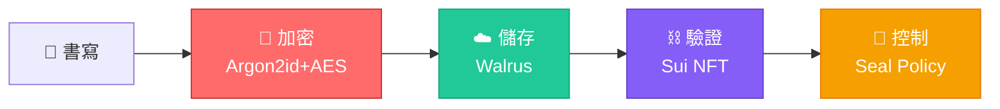

# Echoma - 情感加密鏈

> 你的情感，加密並永久保存在鏈上

[English Version](./README.md)

Echoma 是一個基於 Web3 的情感記錄應用，結合了客戶端加密、去中心化儲存和區塊鏈驗證，為你的情感數據提供隱私保護和永久儲存。

---

## 🏗️ 一眼看懂架構



### 🎯 Echoma 的差異化優勢

| 功能 | 傳統 Web3 日記 | Echoma |
|------|---------------|---------|
| **加密方式** | ❌ 無或伺服器端 | ✅ **客戶端 AES-GCM-256** |
| **密鑰派生** | 🔴 PBKDF2（弱） | 🟢 **Argon2id（64MB 記憶體困難）** |
| **儲存方案** | 🟡 IPFS 網關 | 🟢 **Walrus（Sui 原生）** |
| **訪問控制** | ❌ NFT = 完全訪問 | ✅ **動態授權/撤銷** |
| **隱私保護** | 🔴 元數據洩露 | 🟢 **零知識證明** |

📖 **[查看完整架構圖 →](./ARCHITECTURE_VISUAL.md)**

---

## ⚠️ 重要聲明

**Echoma 僅提供情感記錄與一般性支持，不能替代專業醫療建議。**

本應用程式旨在幫助用戶記錄和追蹤情感狀態，但不提供醫療診斷、治療建議或緊急醫療服務。如有心理健康或醫療需求，請尋求專業醫療人員的協助。

## ✨ 核心特性

- 🔒 **客戶端加密** - 使用 AES-GCM 加密，數據在離開設備前就已加密
- 🌊 **Walrus 儲存** - 去中心化、可驗證的儲存方案
- ⛓️ **Sui 區塊鏈** - NFT 形式的鏈上驗證證明（已實現，支持每日鑄造和交易追蹤）
- 🤖 **AI 輔助分析** - 智能情感分析和溫暖回應（支持中英文，匿名和認證模式均可用）
- 📊 **時間線視圖** - 可視化你的情感歷程，支持虛擬滾動優化（即使 1000+ 條記錄也能流暢滾動）
  - 完整的情感趨勢圖表（情緒分布、時間趨勢、趨勢預測、關聯分析、情緒日曆）
  - 強大的搜索、過濾和排序功能
  - 批量操作和數據導出（CSV、JSON、PDF、Markdown）
- 🏷️ **標籤分類** - 為記錄添加自定義標籤，支持多標籤和標籤過濾
- 📤 **數據導出** - 支持導出為 CSV、JSON、PDF、Markdown 格式，支持自定義字段和日期格式
- 🔄 **實時同步**（認證模式）- 使用 Supabase Realtime 自動同步數據變化，支持多設備實時更新
- 🌍 **多語言支持** - 支持繁體中文和英文切換
- 🌓 **主題切換** - 支持淺色/深色/跟隨系統主題切換（默認淺色主題）
- 👤 **多種模式** - 匿名模式、認證模式和 MVP 本地模式
- 🛡️ **錯誤邊界** - 完整的錯誤捕獲和友好錯誤提示
- 📱 **響應式設計** - 適配桌面和移動設備

## 📱 iOS App 支持

Echoma 現在支持打包成 iOS 原生應用！使用 **Capacitor** 框架，可以將 Web 應用轉換為 iOS app。

### 快速開始 iOS 開發

1. **升級 Node.js**（需要 >= 20.0.0）：
   ```bash
   nvm install 20
   nvm use 20
   ```

2. **構建並添加 iOS 平台**：
   ```bash
   npm run build
   npm run cap:add:ios
   ```

3. **在 Xcode 中打開**：
   ```bash
   npm run cap:open:ios
   ```

詳細說明請查看 [iOS 開發指南](./IOS_Development_Guide.md)

## 🚀 快速開始

### 首次使用

- **醫療免責聲明**：首次使用時會顯示醫療免責聲明，需要確認後才能繼續使用
- **引導流程**：首次訪問首頁時會顯示引導流程，介紹主要功能（可跳過）

### 前置要求

- Node.js 18+ 和 npm（推薦使用 [nvm](https://github.com/nvm-sh/nvm#installing-and-updating) 安裝）
- Sui 錢包（如 Sui Wallet 或 Ethos Wallet）
- iOS 開發需要：Node.js 20+、Xcode 14+、CocoaPods

### 安裝步驟

```sh
# 1. 克隆倉庫
git clone <YOUR_GIT_URL>
cd echoma

# 2. 安裝依賴
npm install

# 3. 啟動開發伺服器
npm run dev
```

應用將在 `http://localhost:5173` 啟動。

### 本地開發服務器（可選）

如果需要使用本地開發服務器（用於某些 API 調用），可以單獨啟動：

```sh
# 在另一個終端窗口啟動本地服務器
npm run server
```

服務器將在 `http://localhost:3001` 啟動。

**注意**：本地開發服務器是可選的，主要用於開發環境。生產環境通常不需要。

### 構建生產版本

```sh
# 構建生產版本
npm run build

# 預覽生產構建
npm run preview
```

### iOS 開發命令

```sh
# 添加 iOS 平台（首次）
npm run cap:add:ios

# 同步 Web 構建到 iOS 項目
npm run cap:sync

# 打開 Xcode 項目
npm run cap:open:ios

# 一鍵構建、同步並打開 Xcode
npm run cap:build:ios
```

## 🛠️ 技術棧

**前端框架：** React 18, TypeScript, Vite  
**UI 組件：** shadcn/ui, Tailwind CSS, Radix UI  
**Web3 集成：** @mysten/dapp-kit, @mysten/sui, @mysten/walrus  
**後端服務：** Supabase（認證 + 存儲）, Supabase Edge Functions（AI API）  
**核心庫：** TanStack Query/Virtual, React Router, React Hook Form, Zod, i18next, Capacitor  
**性能優化：** 代碼分割、懶加載、虛擬滾動

## 📁 項目結構

```
echoma/
├── src/
│   ├── components/    # UI 組件（shadcn/ui、錢包、主題等）
│   ├── pages/         # 路由頁面（Record、Timeline、Auth、MVP）
│   ├── lib/           # 核心邏輯（加密、存儲、walrus、鑄造）
│   ├── hooks/         # 自定義 React Hooks
│   ├── i18n/          # 國際化（繁中/英文）
│   └── integrations/  # Supabase 集成
├── supabase/          # Edge functions 和數據庫遷移
├── nft_mint_test/     # Sui Move 合約
└── public/            # 靜態資源
```

詳細文件結構請查看代碼庫。

## 🔐 安全特性

Echoma 採用多層安全防護，保護用戶數據和隱私：

- **客戶端加密** – AES-GCM 256 位加密，數據離開設備前已加密
- **用戶自定義密碼** – 可選的自定義加密密碼（推薦使用以增強安全性）
- **密鑰派生** – **Argon2id 完整集成**（記憶體困難，抗 GPU/ASIC 攻擊），自動 fallback 到增強 PBKDF2
- **密碼管理** – 支持密碼重置/更改，自動重新加密數據
- **密鑰版本控制** – 加密密鑰版本管理，自動遷移舊版本
- **Seal 權限模型** – 公開/私密記錄分離，智能解密
- **AI 安全防護** – prompt injection 控制、危機檢測、審計日誌
- **多層速率限制** – 用戶級別（認證 10次/分鐘，匿名 3次/分鐘）+ IP 級別（20次/分鐘）防護
- **安全測試套件** – 端到端密碼學驗證（可重現/可量測/可審計）
- **向後兼容** – 自動遷移舊格式數據

**數據流程：** 記錄 → 加密（使用用戶密碼）→ 儲存（Walrus）→ 驗證（Sui NFT）

📖 **詳細文檔：**
- [THREAT_MODEL.md](./THREAT_MODEL.md) – 威脅模型與設計取捨
- [SECURITY_FEATURES.md](./SECURITY_FEATURES.md) – 完整安全功能說明
- [SECURITY_BEST_PRACTICES.md](./SECURITY_BEST_PRACTICES.md) – 安全審計檢查清單
- [Security_Test_Guide.md](./Security_Test_Guide.md) – 安全測試套件指南
- [ARGON2ID_UPGRADE_SUMMARY.md](./ARGON2ID_UPGRADE_SUMMARY.md) – **新增！** Argon2id 集成完整報告
- [ARGON2ID_QUICK_START.md](./ARGON2ID_QUICK_START.md) – **新增！** Argon2id 快速入門

## 🌐 網路配置

**默認網絡：Sui Mainnet**

- 通過 UI（右上角）在 Testnet 和 Mainnet 之間切換
- 網路偏好持久化保存，跨標籤頁同步
- 自動切換 Walrus 端點（testnet/mainnet）
- 網路感知數據處理，支持跨網路記錄訪問

⚠️ **注意：** 測試網的 Walrus aggregator 可能偶爾無法提供下載服務（數據仍在鏈上，可在 SuiScan 查看）。

📖 詳見 [WALRUS_SETUP.md](./WALRUS_SETUP.md) 了解 Walrus 儲存期限（epochs）詳情。

## 💧 獲取測試代幣

Walrus 上傳需要 **SUI** 和 **WAL** 測試代幣。

📖 詳見 [Faucet_Test_Token_Guide.md](./Faucet_Test_Token_Guide.md) 了解水龍頭連結和使用說明。

## 📝 使用說明

### 三種使用模式

Echoma 提供三種不同的使用模式，滿足不同需求：

#### 1. 匿名模式（Wallet Mode）
- **路由：** `/record`, `/timeline`
- **適用：** 去中心化存儲，無需登入
- **快速步驟：** 連接錢包 → 記錄情感 → 選擇 Walrus 儲存（設定 epochs）→ 啟用「鑄造為 NFT」→ 記錄並鑄造
- **功能：**
  - 可選 AI 情感分析（3 次/分鐘，無需登入）
  - Walrus 儲存，可配置保留期限（1–1000 epochs，約 1 天/epoch）
  - NFT 鑄造：**測試網和主網均無限制**（合約支持同一天多次鑄造）
  - 自動創建 Journal、交易追蹤、Timeline 標記

#### 2. 認證模式（Secure Mode）
- **路由：** `/auth-record`, `/auth-timeline`
- **適用：** 跨設備訪問和 AI 輔助分析
- **功能：** Supabase 登入、雲端備份、AI 分析（10 次/分鐘）、跨設備實時同步

#### 3. MVP 模式（Local Mode）
- **路由：** `/mvp`, `/mvp-timeline`
- **適用：** 快速體驗、離線使用，無需錢包或登入
- **功能：** 完全本地存儲、AES-GCM 256 加密、自動密鑰管理

### 時間線體驗

**功能：**
- 搜索、過濾（標籤、日期、儲存類型）和排序
- 批量操作（導出/刪除）
- 數據導出（CSV/JSON/PDF/Markdown），支持自定義字段和日期格式
- 情感分析（分布、趨勢、預測、關聯、日曆）
- 虛擬滾動（1000+ 條記錄仍流暢）
- 自動解密本地和公開 Walrus 記錄
- 手動解密重試私密記錄
- Supabase 實時同步（僅認證模式）

### AI 情感分析

在匿名模式和認證模式下均可使用。

- 溫暖、同理心的回應，支持繁體中文和英文
- 速率限制：3 次/分鐘（匿名），10 次/分鐘（認證）
- 安全特性：prompt injection 控制、危機檢測、審計日誌

## 🔑 密碼管理

Echoma 現在支持用戶自定義加密密碼，增強數據安全性。

### 功能特性

- **自定義密碼** – 設置您自己的加密密碼（推薦使用，比僅依賴錢包加密更安全）
- **首次設置** – 首次使用時可選的密碼設置對話框（可跳過）
- **密碼重置** – 更改密碼並自動重新加密所有數據
- **會話緩存** – 密碼緩存 15 分鐘，減少重複輸入
- **密碼提示** – 可選的提示信息儲存在本地（明文），幫助您記憶
- **密鑰版本控制** – 自動版本追蹤和遷移支持

### 使用方式

1. **初始設置**（可選）
   - 首次使用時，會提示您設置加密密碼
   - 您可以跳過，稍後再設置
   - 密碼要求：至少 8 個字符，包含字母和數字/符號

2. **密碼重置**
   - 輸入舊密碼進行驗證
   - 設置新密碼
   - 所有本地數據會自動使用新密碼重新加密

3. **數據遷移**
   - 自動從 v1（僅錢包/用戶 ID）遷移到 v2（帶密碼）
   - 向後兼容 - 舊數據仍可訪問
   - 密鑰版本追蹤防止不兼容問題

### 安全提示

⚠️ **重要：**
- 您的密碼**不會被儲存或上傳**到任何地方
- 如果忘記密碼，您**無法**解密您的數據
- 建議使用密碼管理器或記下密碼提示
- 密碼僅適用於本地/MVP 模式數據（不適用於 Walrus 儲存的數據）

## 🚧 開發計劃

### ✅ 已完成
- [x] MVP 核心功能（本地存儲模式）
- [x] 客戶端加密功能（AES-GCM 256 位）
- [x] **本地存儲加密**（所有模式均支持加密本地存儲）
- [x] **數據完整性保護**（防止數據丟失和損壞）
- [x] **智能密鑰管理**（支持賬戶切換時的數據遷移）
- [x] **一鍵解密功能**（批量解密 Walrus 記錄）
- [x] **國際化錯誤處理**（所有錯誤消息支持多語言）
- [x] **Seal 權限控制**（公開/私密記錄分離存儲和加密）
- [x] **公開記錄自動解密**（公開 Walrus 記錄自動解密，防止無限重試）
- [x] **錯誤顯示一致性**（公開和私密記錄的錯誤顯示保持一致）
- [x] **數據分離存儲**（公開和私密記錄分開存儲，避免密鑰混用）
- [x] 版本化加密頭和向後兼容性
- [x] 可配置 PBKDF2（設備自適應迭代次數）
- [x] 增強的安全驗證（Salt/IV 長度檢查）
- [x] 改進的錯誤處理和用戶提示
- [x] Walrus 儲存集成
- [x] Supabase 認證和雲端存儲
- [x] AI 情感分析功能（認證模式）
- [x] **AI 情感分析功能（匿名模式）** - 支持匿名用戶使用 AI 回應
- [x] AI 安全防護（Prompt Injection 防護、危機檢測）
- [x] **匿名用戶速率限制** - 為匿名用戶實現獨立的速率限制機制
- [x] **匿名用戶審計日誌** - 支持匿名用戶的 AI 調用追蹤
- [x] 審計日誌系統（記錄所有 AI API 調用）
- [x] API Key Rotation 機制
- [x] 多語言支持（繁體中文/英文）
- [x] iOS 應用支持（Capacitor）
- [x] 多種使用模式（匿名/認證/MVP）
- [x] 完整的安全測試套件（可重現、可量測、可審計）
- [x] **邏輯問題修復**（7 個高優先級問題已修復）
  - [x] 強度值丟失問題修復
  - [x] 加密密鑰選擇一致性修復
  - [x] 存儲模式回退邏輯改進
  - [x] Timeline 去重邏輯優化
  - [x] 組件卸載安全導航（防止內存泄漏）
  - [x] localStorage 競態條件修復（鎖機制）
  - [x] 時間戳格式統一
- [x] **數據導出增強** - 支持 PDF、Markdown 格式，支持自定義字段選擇和日期格式
- [x] **記錄標籤/分類功能** - 支持多標籤、標籤過濾、標籤搜索
- [x] **虛擬滾動優化** - Timeline 頁面性能優化，支持 1000+ 條記錄流暢滾動
- [x] **認證模式時間線功能同步** - 認證模式時間線現在與匿名模式功能完全一致
  - [x] 虛擬滾動優化
  - [x] 標籤分類和過濾
  - [x] 搜索功能
  - [x] 日期範圍過濾和排序
  - [x] 批量操作
  - [x] 數據導出（CSV、JSON、PDF、Markdown）
- [x] **實時數據同步**（認證模式）- 使用 Supabase Realtime 實現實時同步
  - [x] 新增記錄自動同步
  - [x] 更新記錄自動刷新
  - [x] 刪除記錄自動移除
  - [x] 同步失敗自動降級到定期輪詢
  - [x] 競態條件保護和狀態管理優化
- [x] **情感趨勢分析圖表** - 完整的數據可視化功能
  - [x] 情緒分布餅圖
  - [x] 儲存方式分布餅圖
  - [x] 時間趨勢圖表（支持周/月/年視圖）
  - [x] 情緒趨勢預測（基於線性回歸）
  - [x] 情緒關聯分析
  - [x] 情緒日曆視圖
- [x] **情感數據解密和查看功能** - 完整的解密和查看功能
  - [x] 自動解密（本地記錄和公開 Walrus 記錄）
  - [x] 一鍵批量解密（私密 Walrus 記錄）
  - [x] 手動解密重試（針對解密失敗的記錄）
  - [x] 記錄詳情查看（完整記錄信息對話框）
  - [x] 解密狀態標識和錯誤提示
  - [x] 隱藏已解密內容功能

### ✅ 最近完成
- **🔒 主網 Seal Access Policies (2025-11-22)** – 完整的鏈上訪問控制
  - ✅ 已部署到**主網**，完整支持 Seal Access Policies
  - ✅ **新主網 Package ID**: `0x45f9ba755acaf2306525b4a5b67d32bd4905f56108499306449da7312b76330d`
  - ✅ **PolicyRegistry ID**: `0xdbeb691b5d310d83646b101b72123ad2ed170c7ca834faa90fbda3be01c403e3`
  - ✅ 已部署 3 個模組：diary, diary_with_policy, seal_access_policies
  - ✅ 測試網和主網功能完全對等
  - 📖 詳見 [MAINNET_DEPLOYMENT_SUMMARY.md](./MAINNET_DEPLOYMENT_SUMMARY.md)
- **🔒 Argon2id 集成 (v3.0)** – 生產就緒的記憶體困難密鑰派生
  - ✅ 使用 `hash-wasm` 庫完整集成 WASM
  - ✅ 記憶體困難參數：3 次迭代 × 64 MB × 4 執行緒
  - ✅ 智能 fallback 到增強 PBKDF2（300k+ 迭代）
  - ✅ **安全提升：** 抗 GPU 攻擊 +300%，抗 ASIC 攻擊 +500%
  - ✅ 所有測試通過（5/5），可用於生產環境
  - 📖 詳見 [ARGON2ID_UPGRADE_SUMMARY.md](./ARGON2ID_UPGRADE_SUMMARY.md)
- **Sui NFT 鑄造** – 已部署到測試網和主網
  - 鑄造限制：**測試網和主網均無限制**（合約使用遞增的 count 作為唯一鍵，支持同一天多次鑄造）
  - **測試網 Package ID**: `0x55f1c575f979ad2b16c264191627ca6716c9b0b397ab041280da1ad6bce37e71`
  - **主網 Package ID**（含 Seal Policies）: `0x45f9ba755acaf2306525b4a5b67d32bd4905f56108499306449da7312b76330d`
  - 自動遷移舊 Package ID、CORS 修復
  - 詳見 [nft_mint_test/README.md](./nft_mint_test/README.md) 了解合約詳情

### ✅ 已實現核心功能
- 客戶端 AES-GCM 256 加密、Walrus 儲存、Sui NFT 鑄造
- Supabase 認證和雲端同步、AI 情感分析（匿名 + 認證）
- 多語言 UI（繁中/英文）、iOS 支持、網路切換
- 虛擬滾動時間線、情感分析、數據導出（CSV/JSON/PDF/Markdown）
- 安全測試套件、完善的錯誤處理

### 🚧 進行中 / 計劃中
- ✅ ~~完整 Argon2id 支持~~（✅ **已在 v3.0 完成**）
- 用戶密碼/短語輸入界面（提升密鑰安全性）
- 實時安全監控告警系統
- 性能優化：根據設備能力動態調整 Argon2id 參數

## 🧪 測試

📖 詳見 [Functional_Test_Guide.md](./Functional_Test_Guide.md) 了解詳細測試步驟。

**快速測試：** 運行 `npm run dev`，打開 DevTools Console，貼上 `Quick_Test_Script.js` 並執行。
- ✅ **組件卸載安全** - 防止內存泄漏和 React 警告
- ✅ **localStorage 並發保存** - 實現鎖機制防止數據丟失
- ✅ **去重邏輯優化** - 優先使用 `id` 作為主鍵
- ✅ **強度值保存** - 確保強度值正確保存和顯示
- ✅ **加密密鑰選擇** - 公開和私密記錄正確分離存儲
- ✅ **錢包連接檢查** - 改進錯誤處理和用戶提示

詳細的修復說明和驗證結果請參考測試指南。

## 🤝 貢獻

歡迎提交 Issue 和 Pull Request！

## 📄 許可證

本項目為 Haulout Hackathon 參賽作品。

## 🔗 相關連結

- [Sui 區塊鏈文檔](https://docs.sui.io/)
- [Walrus 儲存文檔](https://docs.walrus.space/)
- [shadcn/ui 文檔](https://ui.shadcn.com/)
- [威脅模型](./THREAT_MODEL.md) - 威脅來源分析與設計取捨理由
- [安全功能說明](./SECURITY_FEATURES.md) - AI 安全防護、審計日誌、API key rotation
- [安全最佳實踐](./SECURITY_BEST_PRACTICES.md) - 加密機制安全審計報告
- [Security_Test_Guide.md](./Security_Test_Guide.md) - 完整的安全測試套件文檔（可重現、可量測、可審計）
- [功能測試指南](./Functional_Test_Guide.md) - 功能測試步驟和驗證方法

## 🔧 環境變數配置

認證模式和 AI 功能所需環境變數：

```env
VITE_SUPABASE_URL=your_supabase_url
VITE_SUPABASE_PUBLISHABLE_KEY=your_supabase_anon_key
LOVABLE_API_KEY=your_lovable_api_key
SUPABASE_SERVICE_ROLE_KEY=your_service_role_key  # 可選，用於 key rotation + 審計日誌
```

📖 詳見 [SECURITY_FEATURES.md](./SECURITY_FEATURES.md) 了解詳細配置、CI 安全檢查和數據庫遷移。

---

**注意**: 本項目目前處於開發階段。核心功能包括 NFT 鑄造已完全實現。MVP 體驗已可在 testnet 上正常使用。
